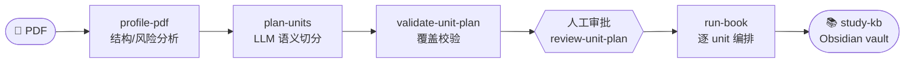
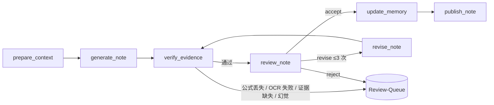

<div align="center">

# 📚 PDF → Study KB

**把一本长篇 PDF 编译成本地 Obsidian 学习知识库**

语义切分 · 人工审批 · LangGraph 编排生成 · 公式/证据门禁 · 一键本地前端


</div>

---

输入一本 PDF，得到一个可以在 Obsidian 里**按主题、难度、阅读路线**导航的知识库——而不是线性地翻 PDF。每个核心结论都带**来源证据引用**，公式从本地 OCR 提取、不允许模型凭空补全。

```text
📄 your-book.pdf
        │   profile → plan → 审批 → run-book
        ▼
📚 books/your-book/study-kb/   ← 直接当 Obsidian vault 打开
   ├── Home.md                 入口：进度 + 阅读路线
   ├── Section-Lessons/        每个语义单元一篇带证据引用的讲义
   ├── Concept-Cards/          核心概念卡片
   ├── Glossary/ · Symbols/    术语表 · 符号表（带来源页码）
   ├── Formula-Ledger/         公式账本（OCR/LaTeX 来源）
   ├── Claims/                 核心结论 → 证据（区分原文压缩/学习解释/个人桥接）
   ├── Questions/              每单元自测题
   ├── Review-Queue/           待人工复核的高风险笔记
   ├── Learning-Maps/          全书地图 · 入门最短路线 · 难点路线
   └── Source-QA/ · Dashboards/  覆盖率 · 风险 · 质量看板
```

## ✨ 特性

- **🖥️ 一键本地前端** — 纯 Python 标准库（`http.server`），**无需 pip / npm**，clone 即用。导入、跑命令（实时日志）、卡片式审批、页内复核、浏览知识库，全在一个网页里。
- **🧠 语义切分 + 人工审批** — LLM 按阅读连贯性切分 unit，不靠正则；人工卡片式接受/编辑/合并/跳过后才进入生成。
- **🔗 来源忠实门禁** — 每条核心结论须引用真实 `evidence_id`；自动拦截**幻觉证据**（引用了不存在的 id）和**未落地的原文结论**；论断区分 `原文压缩 / 学习解释 / 个人桥接`。
- **➗ 公式保真** — 高公式页用 surya-ocr 本地识别为 LaTeX，模型直接嵌入正文；缺证据标 `[公式缺失]` 进复核，不凭空补全。
- **🔁 稳健编排** — LangGraph 逐 unit 生成，支持断点续跑（SQLite checkpointer）、单 unit 失败隔离（不拖垮整本）、瞬时错误/非法 JSON 自动重试、可调并发。
- **📊 完整生态输出** — 讲义、概念卡、术语/符号表、公式账本、证据对照、自测题、阅读地图、覆盖率/质量看板，frontmatter 全部 Dataview 友好。

## 🚀 快速开始

### 1. 安装

```powershell
git clone <your-repo-url>
cd pdf-to-study-kb
pip install -r requirements.txt
```

> [!IMPORTANT]
> 后续所有命令（包括前端）都要用**装了依赖的同一个 Python 解释器**运行。前端会用「启动它的那个 Python」去跑流水线命令，解释器不对会报 `ModuleNotFoundError: No module named 'yaml'` 之类的错。
> 用 conda 的话：`conda activate <你的环境>`，或直接用全路径 `D:\path\to\env\python.exe`。

`requirements.txt` 含 `surya-ocr`（高公式页 OCR，可选）。未安装或推理后端不可用时，高公式页会进入 `Review-Queue/` 人工处理。

### 2. 配置 `.env`

```powershell
copy .env.example .env
```

填入 LLM API（任何 OpenAI-compatible 接口都行，默认 DeepSeek V4）。`.env` 不提交。详见 下方「⚙️ 配置」。

### 3. 启动前端（推荐入口）

```powershell
python scripts/serve.py                 # 默认 http://127.0.0.1:8765
python scripts/serve.py --port 9000     # 换端口
```

打开浏览器，**整个流程在一个页面里点完**：导入 PDF → 逐步跑命令（实时日志）→ 审批切分 → 编译全书 → 处理复核队列 → 浏览知识库。前端只监听本机 `127.0.0.1`。

> 喜欢命令行 / 要脚本化？看 下方「⌨️ CLI 命令」。两者随时可混用。

### 4. （可选）OCR 自检

```powershell
python scripts/surya_smoke.py --book <book-id> --page 1 --keep-alive
```

只识别一页：Surya 返回 `status=ok` 且识别块数 > 0 才返回 exit code 0。首次会下载/加载模型，CPU/llama.cpp 路径较慢；整书运行会复用 `pipeline-workspace/ocr-cache/` 的已识别页。

### 5. 在 Obsidian 中阅读

Obsidian → `Open folder as vault` → 选 `books/<book-id>/study-kb/` → 从 `Home.md` 开始。

## 🖥️ 前端能做什么

| 标签页 | 功能 |
|--------|------|
| **流水线** | 三个按钮跑 `profile-pdf` / `plan-units` / `run-book`，底部实时日志自动滚动；可设并发；编译后显示「已发布 / 待复核 / 失败」统计。顶部步骤条显示进度，关掉浏览器重开会自动接续正在运行的作业。 |
| **切分审批** | 每个 unit 一张卡片（页码、公式风险、OCR 标记、审批状态）；按钮：接受 / 改标题 / 改页码 / 并入前项 / 跳过；「自动判定低风险」一键处理纯文字页；「定稿规划」带覆盖校验。 |
| **待复核** | 列出 `Review-Queue` 的 unit，点开看草稿（可编辑 + Markdown 预览），按钮：保存草稿 / 接受并发布 / 重跑该 unit。 |
| **知识库** | 左侧分类树，点文件右侧渲染 Markdown，带 🏠 Home 入口。 |

## 🧩 架构

两层：**Python 负责 book 级编排**，**LangGraph 负责 unit 级生成循环**。



每个已审批 unit 单独 invoke 一张 LangGraph 图：



**双 SQLite**

| 数据库 | 用途 |
|--------|------|
| LangGraph checkpointer | unit 图状态恢复（断点续跑） |
| 业务库 `study-kb.sqlite` | runs / model_calls / tokens / cost / memory_snapshots / evidence_ledger |

**PDF 提取三档**

| 方式 | 适用 | 实现 |
|------|------|------|
| `text` | 纯文本 / 低公式页 | PyMuPDF 文本抽取 |
| `screenshot_ocr` | 高公式 / 空白变量页 | PyMuPDF 截图 → surya-ocr（中文 + LaTeX） |
| `hybrid` | 混合页（默认） | 段落走文本，公式/表格区域走 OCR |

**模型分工**（均可在 `.env` 覆盖）

| 任务 | 默认模型 |
|------|----------|
| 语义规划 `plan-units` · 修订 `revise_note` · 记忆压缩 | DeepSeek **V4 Pro** |
| 讲义生成 `generate_note` · 审校 `review_note` | DeepSeek **V4 Flash** |
| 公式风险检测 · 高公式页 OCR | 本地 PyMuPDF + surya-ocr |

> ⚠️ `deepseek-chat` / `deepseek-reasoner` 将于 **2026/07/24** 停用，请用 `deepseek-v4-flash` / `deepseek-v4-pro`。

## ⌨️ CLI 命令（无界面/脚本化）

前端只是把这些命令包进网页。CLI 仅 6 个命令：

```powershell
python scripts/pipeline.py <command> --book <book-id> [options]
python scripts/pipeline.py <command> --help
```

| 命令 | 作用 |
|------|------|
| `init-book` | 从 PDF 初始化工作区（`--pdf`、`--title`），生成 book/study/personal 配置 |
| `profile-pdf` | 分析 TOC、页码、文本密度、公式/表格/空白变量风险 |
| `plan-units` | LLM 生成 `semantic-unit-plan.candidates.yaml`（高公式 unit 自动标 hybrid） |
| `validate-unit-plan` | 校验覆盖率、越界、未解释重叠、schema |
| `review-unit-plan` | 人工审批（接受/编辑/合并/拆分/跳过）→ 写 `semantic-unit-plan.yaml` |
| `run-book` | 逐 unit 编排（`--concurrency N`、`--section <id>` 单跑），发布前过 evidence/review 门，结束后重建 Obsidian 索引 |

<details>
<summary>典型一轮命令行流程</summary>

```powershell
python scripts/pipeline.py init-book --book my-book --pdf "C:\path\my.pdf" --title "我的书"
python scripts/pipeline.py profile-pdf       --book my-book
python scripts/pipeline.py plan-units        --book my-book
python scripts/pipeline.py validate-unit-plan --book my-book
python scripts/pipeline.py review-unit-plan  --book my-book   # 交互式审批
python scripts/pipeline.py run-book          --book my-book --concurrency 3
```

</details>

## ⚙️ 配置

`.env`（OpenAI-compatible API；默认 DeepSeek V4）：

| 变量 | 默认 | 说明 |
|------|------|------|
| `LLM_API_KEY` | — | API key |
| `LLM_BASE_URL` | `https://api.deepseek.com` | API 基址 |
| `LLM_MODEL` | `deepseek-v4-flash` | 讲义生成 |
| `LLM_REVIEW_MODEL` | `deepseek-v4-flash` | 审校 |
| `LLM_PLANNER_MODEL` | `deepseek-v4-pro` | 语义规划 / 记忆压缩 |
| `LLM_REVISE_MODEL` | `deepseek-v4-pro` | 修订重写 |
| `LLM_TEMPERATURE` | `0.3` | 采样温度 |
| `LLM_TIMEOUT_SECONDS` | `600` | 读超时（Pro 非流式长响应较慢） |
| `LLM_MAX_RETRIES` | `2` | 瞬时错误/非法 JSON 重试次数（指数退避；4xx 不重试） |
| `LLM_SSL_VERIFY` | `true` | SSL 校验 |
| `RUN_BOOK_CONCURRENCY` | `3` | run-book 并发 unit 数（`1`=完全串行，rolling memory 质量最高） |
| `OCR_PROVIDER` | `surya` | 本地 OCR，无需 API key |
| `LLAMA_CPP_BINARY` | 自动探测 | 显式指定 `llama-server` 路径（CPU/Windows 路径） |

> surya-ocr 本地运行，不要求模型支持图片输入；Surya 2 需要本地 vLLM 或 llama.cpp 后端，Windows/CPU 优先用 `llama-server.exe`。

### Dataview 友好

所有笔记 frontmatter 含统一字段（`type`、`unit_id`、`chapter`、`difficulty`、`formula_risk`、`status`、`concepts`、`symbols`、`depends_on`、`source_pages`、`risk_flags`…）：

```dataview
TABLE difficulty, formula_risk, status
FROM "Section-Lessons"
WHERE status = "published"
SORT chapter
```

## 📂 项目结构

```text
pdf-to-study-kb/
├── scripts/
│   ├── serve.py              # 本地前端 HTTP 服务（标准库）
│   ├── web_ops.py            # 前端调用的业务逻辑
│   ├── pipeline.py           # CLI 入口（6 命令）
│   ├── pdf_profile.py        # PDF 结构 / 风险分析
│   ├── unit_plan.py          # 语义切分、校验、人工审批
│   ├── unit_context.py       # 按 unit 抽取文本 / OCR / 证据
│   ├── ocr_surya.py          # surya-ocr + llama.cpp 适配
│   ├── run_book.py           # book 级编排（并发 / 续跑 / 失败隔离）
│   ├── langgraph_worker.py   # unit 级 LangGraph 图
│   ├── evidence_verifier.py  # 证据 / 公式 / 幻觉门禁
│   ├── review_gate.py        # 审校输出门
│   ├── memory_store.py       # rolling memory + 业务库重建
│   ├── business_db.py        # 业务 SQLite
│   ├── cost_guard.py         # token/成本预算
│   ├── obsidian_indexes.py   # Obsidian 索引 / 卡片生成
│   └── llm_provider.py       # OpenAI-compatible provider（含重试）
├── webapp/index.html         # 单页前端（Tailwind/Alpine/marked via CDN）
├── templates/ · schemas/     # 讲义/审校模板 · JSON schema
├── tests/                    # pytest
├── docs/                     # 实现指导 / ADR / 领域文档
└── books/<book-id>/          # 本地书籍工作区（不提交，仅留原始 PDF）
    ├── input/ · config/
    ├── pipeline-workspace/   # staging / reviews / runs / checkpoints / state / reports
    └── study-kb/             # 最终 Obsidian vault
```

> `books/` 默认不提交（原始 PDF、SQLite 状态库、中间产物、生成的知识库都不入库）。详见 [执行指导文档](docs/semantic-pdf-to-obsidian-implementation-guide.md)。

## ⚠️ 已知限制

- **OCR 后端不可用时**：高公式页标 `formula_risk=high` 进 `Review-Queue/`，需人工补公式后发布。
- **不支持纯扫描件**：surya-ocr 对老旧扫描件准确率较低；中文常规排版约 82.5%，公式以 LaTeX 输出，可能需 review 校验。
- **证据门禁是「高精度而非全覆盖」**：能确定性拦截幻觉证据和未落地结论；「引用的证据是否真的支撑该句」属语义判断，交由 reviewer 模型 + 人工 Review-Queue。
- **成本上限是估算**：per-unit / per-book token 上限基于字符估算，实际可能有偏差。
- **端到端仍需实跑验证**：不同排版的 PDF 可能遇到未覆盖的边界；失败会被隔离进复核队列，不会污染知识库。
