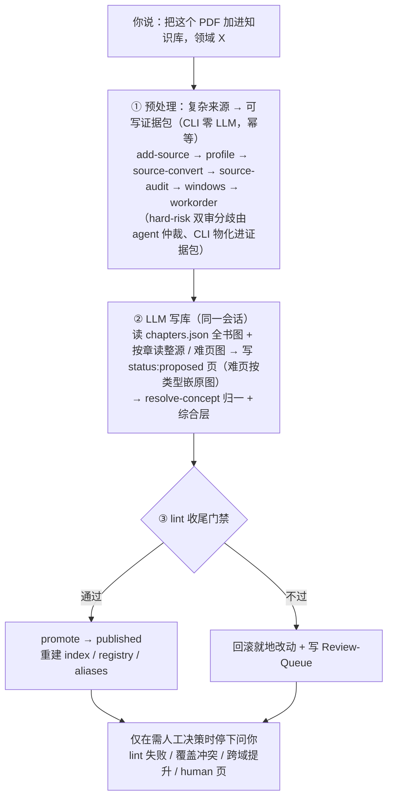

# 📚 PDF → Study KB

> 把 **PDF / DOCX / PPTX / Markdown** 多来源文档，用**对话**增量编译进一个**不断长大、跨领域、按概念导航的本地 Obsidian 学习知识库**。

<p align="center">
  
  
  
  
  
</p>

这是一个 **对话式 agent 驱动的知识库编译器**：你在 **Claude Code 或 Codex**（任选其一）里用自然语言说“把这本书加进知识库”，背后的 LLM 就会自己跑完**预处理 → 写笔记 → 概念归一 → 收尾发布**全流程。两个 agent 共享同一套确定性 CLI 与同一个 vault，行为一致、可互换。不是“按章节翻译原文”，而是 [llm-wiki](https://gist.github.com/karpathy/442a6bf555914893e9891c11519de94f) 模式：相同概念**合并更新**，新内容**新增页面**，库越长越互联。

> **它不是什么**：不是 PDF 翻译器，不是单篇摘要工具，也不是无人值守的批量转换器——唯一的 LLM 是你**手动触发**的对话；只读 / 翻译 / 解释类请求不会写库。

> [!NOTE]
> **项目真值**：Claude Code 看 [`CLAUDE.md`](CLAUDE.md)，Codex 看 [`AGENTS.md`](AGENTS.md)（两者对等、调同一套 CLI）。skill 运行时协议在 [`docs/skill-runtime/`](docs/skill-runtime/)。

---

## 目录

**快速上手**

- [✨ 它解决什么](#-它解决什么)
- [🚀 安装（克隆后三步）](#-安装克隆后三步)
- [💬 如何使用（端到端工作流）](#-如何使用端到端工作流)

**深入：架构与组件**

- [🏗️ 架构](#️-架构)
- [🧱 来源文档预处理四层链路](#-来源文档预处理四层链路)
- [🗂️ 项目结构](#️-项目结构)
- [🧩 对话式 skills 全表](#-对话式-skills-全表)
- [🛠️ 底层：确定性 CLI（高级控制与排障接口）](#️-底层确定性-cli高级控制与排障接口)
- [📂 Vault 结构与产物来源](#-vault-结构与产物来源)
- [✅ 适用与不适用](#-适用与不适用)
- [⚠️ 使用须知与产出边界](#️-使用须知与产出边界)
- [🚦 发布门禁与人工决策点](#-发布门禁与人工决策点)
- [🔄 状态机与故障恢复](#-状态机与故障恢复)
- [⏸️ 中断续跑（上下文上限 / 模型不可用）](#️-中断续跑上下文上限--模型不可用)
- [👓 在 Obsidian 中阅读](#-在-obsidian-中阅读)
- [🧪 开发与测试](#-开发与测试)
- [🤝 Contributing](#-contributing)
- [📚 文档导航](#-文档导航)

---

## ✨ 它解决什么

| 痛点 | 本项目的做法 |
|------|------|
| 多本书各存一份笔记，概念重复、互不连通 | 单一 vault、按领域分区；同一概念**走唯一入口合并**，绝不重复建页 |
| 笔记是线性翻译，越读越像目录 | **概念/主题为主**组织，lessons 跟随源 TOC 只作线性辅助层 |
| 要记一堆命令、手动跑流水线 | **对话式**：一句“把这本书加进知识库”，skill 自己编排全流程 |
| 公式/图表在 PDF 里转写易碎 | 文本走 PyMuPDF，**难页渲染整页 PNG** 交 Claude 多模态读图，写成 KaTeX |
| 自动写库直接覆盖手改内容 | **两阶段发布** + 覆盖保护：先写 `proposed`，过门禁才 `published`，失败回滚进 Review-Queue |

---

## 🚀 安装（克隆后三步）

**前置：** [Python](https://www.python.org/) 3.12+、[Claude Code](https://claude.com/claude-code) 或 **Codex**（任选其一作为对话接口）、[Obsidian](https://obsidian.md/)（可选，用来阅读成品）。

```bash
# ① 克隆并进入项目
git clone https://github.com/Iabstergo1/pdf-to-study-kb.git
cd pdf-to-study-kb

# ② 安装依赖（建议用虚拟环境 / Conda 环境，避免污染全局）
python -m pip install -r requirements.txt

# ③ 自检：核心依赖就位（应打印 PyMuPDF 与 PyYAML 版本）
python -c "import fitz, yaml; print('PyMuPDF', fitz.VersionBind, '| PyYAML', yaml.__version__)"
```

装好后，用 **Claude Code 或 Codex** 打开本项目根目录，即可进入下一节的对话流程。

> [!NOTE]
> **Claude Code 与 Codex 完全对等、二选一即可**：两者各读自己的项目真值（[`CLAUDE.md`](CLAUDE.md) / [`AGENTS.md`](AGENTS.md)）与各自的 skill 树（[`.claude/skills/`](.claude/skills/) 与 [`.agents/skills/`](.agents/skills/)，两树**字节对等**），但**调用同一套 CLI、操作同一个 `wiki/`**，因此行为一致、可互换。你**无需两个都装**。

> [!NOTE]
> 必需依赖只有 **PyMuPDF + PyYAML**（见 [`requirements.txt`](requirements.txt)）。
> 默认 fast path 视觉保真走 route B：`source-convert` 用 PyMuPDF 抽文本，**难页（公式 / 矢量图 / 表 / 图表标题）高召回渲染整页 PNG**，由 ingest **读图**保真（公式写 KaTeX）。fast path 不依赖重型 OCR/ML。

> [!TIP]
> **MinerU 结构化后端（PDF 验收的必需 structural reviewer + 扫描 / 低文本 PDF、DOCX / PPTX 的 primary 解析）**：`source-audit` 用 MinerU 复核每个 PDF 的 PyMuPDF 抽取（双审 → `reconciliation.json`，因 PyMuPDF 阈值刻意宽、不可作单一真值），**strict / 生产验收必需、MinerU 不可用即 fail-closed**；`--backend auto` 亦把扫描 / 低文本 / DOCX / PPTX 自动路由给 MinerU（未装则 fail-closed、不伪装成功）。一键按机型装：
> ```bash
> python scripts/install_mineru.py        # 装 mineru[core]，再据 nvidia-smi 自动换匹配的 CUDA torch；无 GPU 则保留 CPU
> python scripts/install_mineru.py --dry-run   # 先看将执行的命令
> ```
> 仅用 MinerU 的 `pipeline` 后端，**低显存 GPU（约 4GB 即可）**；详见 [`requirements.txt`](requirements.txt) 末尾的 MinerU 段。

---

## 💬 如何使用（端到端工作流）

打开项目后**全程用自然语言对话**，模型按意图自动调用对应 skill（也可手动输入 `/<skill>`）。你**无需记命令、也无需自己撰写笔记内容**——内容由模型在对话中生成。典型一本书的流程只有三步：

### ① 填学习目标 —— 唯一需要你手写的输入（可选但推荐）

第一次对话前，先初始化 vault 脚手架（若 agent 尚未自动建库，可直接说一句“初始化知识库”或手动跑 `python scripts/pipeline.py init-vault`），然后编辑 **`wiki/_meta/purpose.md`**：写下你的**学习目标、当前重点、偏好的讲解风格**（如应试导向 vs 研究导向、偏直觉 vs 偏推导、哪些章节是重点）。

这是 `init-vault` 落下的空模板，也是**整个 vault 里唯一为你准备、需要你手写的文件**；`ingest` 在 [输入阶段读取它](.claude/skills/ingest/SKILL.md)，作为**贯穿写页与综合层的全局写作偏好**（中断续跑时每个新会话会重新读取）。其余所有内容页都由模型生成，你都不用碰——填不填都能跑，但填了产出更贴合你的需求。

### ② 一句话入库（ingest）

把 **PDF / DOCX / PPTX / Markdown** 放进 `books/<name>/input/`，然后对 agent 说一句话即可。下例用占位符 `<...>` 表示你自己的文件与领域：

```text
你：把 books/<name>/input/<your-file>.pdf 加进知识库，领域 <domain>

Claude / Codex（ingest skill）：
  → 与你确认 source_id 与 domain（由文件名 / 你的指定派生）
  → 跑预处理：add-source → profile → source-convert → source-audit →（有 hard-risk 双审分歧则 agent 仲裁 → arbitration-apply）→ windows → workorder → preflight-eval
  → 先读 chapters.json（全书章节图）建立全书理解，再按章组织、读整源 / 难页图，写 concepts/lessons（难页按类型嵌原图，status: proposed）
  → 经 resolve-concept 归一同名概念（命中即合并，绝不重复建页）
  → 跑收尾 lint：通过则 promote 进 index；失败则回滚 + 写 Review-Queue 并告诉你怎么修
  → 汇报：发布了哪些页 / 哪些进了复核队列
```

`ingest` skill 端到端跑完**预处理 → 写 proposed 页 → 概念归一 → 收尾 lint 发布**，只在需人工决策时停下问你（lint 失败 / 覆盖冲突 / 跨域提升 / human 页）。`books/` 目录不入版本控制——放哪本书、产出什么内容，都只存在于你本地。

> [!NOTE]
> **每本书的入库是一次需付费的 LLM 操作**，并非“导入即用”。项目交付时为空库，内容通过运行 ingest 逐步生成。想先零成本验证预处理链，可只跑 `source-preflight`（见下表）。

### ③ 在 Obsidian 阅读成品

Obsidian → **Open folder as vault** → 选项目里的 `wiki/` 目录，从 `overview.md` 开始（阅读技巧见〈[在 Obsidian 中阅读](#-在-obsidian-中阅读)〉）。

> [!IMPORTANT]
> “总结这篇 / 解释这段 / 翻译一下 / 问个常识”这类只读请求**不会**触发写库——skill 的描述里写了负样本，模型会当普通问题回答。

---

## 🏗️ 架构

**对话编排层**（Claude Code / Codex skills，唯一 LLM）+ **确定性执行层**（Python CLI，零 LLM）。
skill 只是自然语言指令，通过 shell 调用 CLI；**所有业务逻辑、安全守卫都在 CLI 里**。

**为什么分两层**：把"可重复、可观测、可守卫"的工作（状态机、并发锁、lint 门禁、覆盖保护、索引重建）全部下沉到零-LLM 的确定性 CLI，由 `tests/` 当规格覆盖；只把唯一高价值、无法确定化的工作（读整源写笔记、跨页归并概念）留给人触发的 LLM 会话。好处是**安全性与"模型是否自动触发 skill"解耦**——即便误触发，写库仍要逐一过 CLI 守卫与两阶段门禁，越不过就回滚，不会污染已发布内容。

> **预处理本身也几乎全是零-LLM 的确定性 CLI**；唯一的例外是 agent 对 **hard-risk 双审分歧**的结构化仲裁——它只读最小证据包、只输出 `render` / `ignore` / `needs_human` 裁决，由 CLI 确定性物化（补图 / 置 `needs_vision` / 标风险），并同样受 strict 验收门约束：未闭环就阻断，agent 不直接改任何产物。



**四条核心约束：**

1. **不拆分** — 不让 LLM 做语义切分；长源用确定性 *processing windows*（TOC / 页码 / token 滑窗）读取，窗口只是“读取单位”，不决定 wiki 页面结构。
2. **概念去重** — 所有概念创建/更新走单一 `resolve-concept` 入口，命中合并、绝不重复建页；`_registry.yaml` / `aliases.md` 是**派生文件**。
3. **两阶段发布** — 先写 `status: proposed`；收尾 `lint` 过门禁才 promote 成 `published` 并入 index，失败回滚 + 进 `Review-Queue/`。
4. **覆盖保护** — 写已存在页须满足“在快照中 + `managed_by != human` + hash 一致”三条件，否则拒写、出 proposal。

> 自动触发不削弱安全：第 3、4 条由确定性 CLI 守卫强制执行，与“skill 是否被模型自动调用”正交。

---

## 🧱 来源文档预处理四层链路

真实来源不是一坨纯文本：可能夹着公式、表格、图片、扫描页、多栏排版。本项目把"**复杂来源文件 → 可写证据包**"拆成四层确定性链路——**解析与双审 → 结构还原与证据归一 → 读取窗口与导航 → agent 仲裁与确定性验收**。每层都是一道**路由**：按来源类型选解析后端、按证据可信度决定哪些页要带图、按全书结构给出读取边界、按风险是否闭环决定能否交给写库 LLM。四层全部落在**确定性、可重跑**的 CLI 与产物契约里；其中唯一的有界 LLM 是 agent 对 **hard-risk 分歧**的结构化仲裁（CLI 负责检测 / 整理 / 物化 / 验收，零 LLM）。最终交给对话写库 LLM 的，是一份**带页码、章节、风险标记、视觉资产的证据包**，而非可能失真的裸文本。

| 层 | 承担者（脚本/产物） | 做什么（这层是什么路由） | 关键字段 |
|------|------|------|------|
| **L1 解析与双审** | `source_profile` / `source_convert` / `source_backends` / `source_audit` | **来源类型路由**：按 markdown / native PDF / scanned PDF / low-text PDF / mixed PDF / DOCX / PPTX 选后端（PyMuPDF / MinerU / markdown）。PDF 走 PyMuPDF 快速抽取 + **MinerU 作必需 structural reviewer 双审**（`source-audit` 记录分歧 / 接受 / 降级）；扫描·低文本 PDF、DOCX / PPTX 由 MinerU primary 解析；MinerU 不可用 **fail-closed**（绝不伪装成功） | `parse_report.json`：`source_type` · `backend_reason` · `selected_backend` · `dual_audit_required` ＋ `reconciliation.json`：`dual_audited` · `review_status` · `disagreements` · `degraded` |
| **L2 结构还原与证据归一** | `blocks.jsonl` · `chapters.json` · `evidence.json` · `assets/` | 保留页码、标题层级、章节、段落、表/图/公式；**`source.md` 是主顺读文本，但不是绝对真相、预处理绝不重写它**——哪些页文本不可信（公式抽碎 / 表被线性化 / 图缺资产），由 `evidence.json` + `risk_flags` + `assets` **旁路补足**（证据路由），而不是改写正文 | block：`page` · `block_id` · `type` · `heading_path` · `chapter_id` · `source_ref` · `risk_flags` · `element_id`（表→`t{n}` / 图→`f{n}`） ＋ `evidence.json`：`risk_flags_by_page` · `candidates` · `soft_risk_pages` |
| **L3 读取窗口与导航** | `chaptering` / `windowing` · `chapters.json` · `windows.jsonl` | **读取导航层**：`chapters.json` 给全书结构导航，`windows.jsonl` 给 ingest LLM 局部读取边界（block-aware、顺序稳定、可追溯、**长表不切**）。窗口只是**读取单位，不决定最终 wiki 页面结构** | window：`source_id` · `chapter_title` · `page_start`–`page_end` · `block_ids` · `contains` · `assets` · `risk_flags` · `source_refs` |
| **L4 agent 仲裁与确定性验收** | `source-audit` · `arbitration-*` · `preflight-eval` · `source-preflight` · `ingest` | **写前路由 + 证据闭环**：`source-audit` 把"哪些 hard-risk 分歧需仲裁"整理成 arbitration queue；**agent 只读最小证据包、输出 `render` / `ignore` / `needs_human` 结构化裁决**，CLI 物化（补整页图 / 置 `needs_vision` / 标风险）；`preflight-eval` 跑 **11 项**确定性验收——strict 把关的是"**交给 ingest LLM 的证据是否完整闭环**"，不是"双审跑没跑" | `arbitration/{queue,decisions}.json` ＋ `preflight_eval.json`：11 项（页码 / 窗口单调 / asset·source_ref 可追溯 / `dual_audit` / `evidence_bundle` / `risk_coverage` / 扫描·OCR / 孤儿块 / 字段契约）；`--strict` 遇 high/fail **非零退出** |

> **可追溯引用贯穿四层**：每个 block 带 `source_ref`（`p{页码}#{块号}`）＋ `chapter_id` ＋ `element_id` ＋ `risk_flags`，每个 window 列出其 `source_refs`，写库时 `lint` 强制 lesson 可追溯回来源——产出能落到“第几页、第几张表”，而非无源的自信。零成本先验：`python scripts/pipeline.py preflight-eval --source <src> --strict`（见下方 CLI）。

---

## 🗂️ 项目结构

仓库分工一目了然：**业务逻辑只在 `scripts/`**，对话编排在两套**字节对等**的 skill 树，运行时产物（`wiki/` `pipeline-workspace/` 与 `books/` 内容）一律 gitignore——每机自有、不入版本控制。

```text
pdf-to-study-kb/
├── CLAUDE.md                 # Claude Code 的项目真值（架构 / 约束 / 协作）
├── AGENTS.md                 # Codex 的项目真值（与 CLAUDE.md 对等）
├── README.md                 # 本文件
├── requirements.txt          # 仅 PyMuPDF + PyYAML + pytest
├── scripts/
│   ├── pipeline.py           # ⭐ 唯一 CLI 入口（38 子命令，全部业务逻辑在此）
│   ├── state_store.py / locks.py                # 业务 SQLite 状态机 / 单-ingest 并发锁
│   ├── source_profile.py / source_convert.py / source_artifacts.py / chaptering.py   # L1 解析 + L2 结构契约
│   ├── source_backends/      # 后端：pymupdf（fast path）/ markdown / 可选 mineru（结构化）
│   ├── windowing.py / workorder.py / preflight_eval.py   # L3 切窗 / 事务契约 / L4 验收门
│   ├── concept_store.py / promotion.py          # 概念归一唯一入口 / 跨域提升
│   ├── wiki_gate.py / page_rules.py / mdpage.py # lint 门禁 / 页规则 / frontmatter
│   ├── snapshots.py / ingest_guards.py / query_session.py  # 快照 / 写守卫 / 查询会话
│   ├── install_mineru.py                         # 可选：按机型自动装 MinerU + 匹配 CUDA torch
│   └── resume-ingest.ps1                         # 无人值守续跑（OS 调度脚本，模型可用性探针 + 有界续跑）
├── .claude/skills/<name>/SKILL.md   # 9 个对话式 skill（Claude 读）
├── .agents/skills/<name>/SKILL.md   # 同 9 个（Codex 读，与上者字节对等）
├── docs/skill-runtime/       # skill 运行时协议（routing / schema / 概念归一 / save-back / 标准）
├── templates/                # 各页类型模板（concept / lesson / topic / comparison / synthesis / source / overview）
├── tests/                    # 确定性测试（即规格）
├── books/<name>/input/       # 你放原始来源处（gitignore，内容不入库）
├── wiki/                     # 生成的 Obsidian vault（gitignore，每机运行时状态）
└── pipeline-workspace/       # staging / 状态库 / 快照 / 报告（gitignore）
```

---

## 🧩 对话式 skills 全表

在 Claude Code 或 Codex 中，**直接用自然语言描述即可**——模型会按意图自动调用对应 skill（也可手动输入 `/<skill>`）。两套 agent 各读自己的 skill 树（`.claude/skills/` 与 `.agents/skills/`），但**字节对等、调用同一套 CLI**，因此行为一致。
所有写库 skill 全程受确定性 CLI 守卫保护，只写 `status: proposed`。

| skill | 一句话说什么就触发 | 它做什么 |
|------|------|------|
| **`ingest`** | “把这本书 / 这个 PDF 加进知识库，领域 X” | ⭐端到端：预处理 → 写 proposed → 收尾 lint，只在需决策时停 |
| **`kb-query`** | “知识库里关于 X 怎么说” | 只读查询 + 持久化 query-session（**不写库**） |
| **`kb-save`** | “把刚才那个对比 / 结论存进 wiki” | 把 query-session 候选存为 proposed（有准入门槛） |
| **`kb-review`** | “处理一下复核队列” | 逐条过 Review-Queue，给建议、人工定夺 |
| **`wiki-lint-semantic`** | “给知识库做个语义体检” | 查对比维度 / 跨页矛盾，只出 proposal |
| **`kb-qa`** | “给知识库做次 QA / 审计覆盖率” | 体检已发布库或保存前候选，产出报告 + Review-Queue proposal（只读不改库） |
| **`source-preflight`** | “先预处理这个 PDF / 看看能不能 ingest” | 只跑确定性预处理链并验收 staging，不写语义页（**零-LLM 验收门，可零成本先验证**） |
| **`source-xray`** | “给这个已发布来源做拆书阅读笔记” | 基于已发布内容生成 xray 笔记 / synthesis 候选报告，默认只写 `reports/` |
| **`skill-evolve`** | “把这次踩的坑沉淀进 skill / 让 skill 自我改进” | skill 自进化：mine 反复失败 → 你提炼 bounded 编辑 → gate(pytest+双树) → 人 adopt（改的是 skill 自己，不写 vault） |

---

## 🛠️ 底层：确定性 CLI（高级控制与排障接口）

所有 skill 背后调用的都是 `python scripts/pipeline.py <command>`（零 LLM、可独立运行，**全部业务逻辑与安全守卫都在这里**）。日常对话无需手动输入；该接口面向**精细控制、问题排查、手动重跑某一阶段、无人值守脚本化**等高级场景。

命令按生命周期分五组：**状态与维护**（看清进度、崩溃自救）、**预处理**（把"读取与切窗"做成确定性可重跑链）、**ingest 会话支撑**（保证写库可断点续跑、不越界、不覆盖人工页）、**收尾与查询**（两阶段发布的门禁与提升）、**skill 自进化**（把反复失败沉淀成有界改进）。共 38 个子命令：

<details>
<summary><b>展开：完整 CLI 命令参考</b></summary>

### 状态与维护

> **为什么有这组**：ingest 是可中断的长任务，且同一 vault 受并发锁保护。这组命令让你不依赖 LLM 就能"看清现状 + 崩溃自救"——`status`/`next` 回答"每个来源走到哪一步、锁在谁手里、下一步该做什么"；`fail` 把崩溃残留的 `running` 阶段标记 `failed` 以便重跑；`unlock` 受控回收超时的 stale 锁（活锁拒绝，防误删）；`rebuild-registry` 从概念页 frontmatter 重建派生索引；`rebuild-graph` 从 published 图谱重建 graph-data + 离线 HTML 力导向图（派生阅读层，fail-hard）、`graph-lint` 校验图谱产物；`init-vault` 幂等搭起空脚手架。

| 命令 | 作用 | 关键参数 |
|------|------|------|
| `status` | 列出每个 source 的阶段/状态 + vault 锁持有者（`[STALE]` 标记崩溃残留锁） | — |
| `next` | 列出每个 source 的**下一步人工动作** + stale 锁清理建议 | — |
| `init-vault` | 建 `wiki/` 脚手架 + 种子文件（幂等，不覆盖） | — |
| `unlock` | 受控回收 stale vault 锁；活锁拒绝 | `--ttl 1800` |
| `fail` | 把崩溃残留的 `running` 阶段标记 `failed` | `--source --stage --error` |
| `rebuild-registry` | 从概念页 frontmatter 重建 `_registry.yaml` + `aliases.md` | — |
| `rebuild-graph` | 从 published 图谱重建 `graph-data.generated.json` + `knowledge-graph.generated.html`（力导向图，派生阅读层，fail-hard） | — |
| `graph-lint` | 校验 graph-data(+HTML)：fail-hard 非零退出、warn-only 不阻断 | — |

### 预处理（零 LLM，顺序固定，幂等跳过）

> **为什么有这组**：把"解析、双审、切窗、验收"做成**确定性、可重跑**的固定链，LLM 才不必做语义拆分（核心约束①不拆分）。顺序固定、每步幂等：失败重跑不会污染状态，已完成的步骤自动跳过。最终产出 `source.md`（主抽取文本，**预处理绝不重写它**）+ `reconciliation.json` / `evidence.json`（双审与逐页风险证据）+ `windows.jsonl`（确定性读取单位）+ `chapters.json`（据 PDF 书签确定性切出的章节图 / 导航脊柱，sha256 冻结）+ `workorder.yaml`（写入边界与 registry 快照），共同组成 LLM 写库的**证据包输入契约**——LLM 先读 chapters.json 建全书理解、按章组织，只在 workorder 划定的范围内写。

| 命令 | 作用 | 输入 → 产出 | 关键参数 |
|------|------|------|------|
| `add-source` | 注册来源到状态库 | 原始文件 → `sources` 记录 | `--source --domain --path --fmt {pdf,md,docx,pptx}` |
| `profile` | 逐页 profile + `needs_vision` 判定 | raw → `staging/<src>/pages.jsonl` | `--source` |
| `source-convert` | 转干净 Markdown + `blocks.jsonl`，难页渲 PNG，切章节图；后端按 L1 **来源类型路由** | raw → `staging/<src>/source.md` + `blocks.jsonl` + `assets/` + `chapters.json` + `parse_report.json` | `--source [--backend auto\|pymupdf\|mineru] [--mineru-policy conservative\|aggressive]` |
| `source-audit` | **PDF 双审**：MinerU 复核 PyMuPDF → `reconciliation.json`，并产逐页风险 `evidence.json` + hard-risk 仲裁队列 | source.md/blocks → `reconciliation.json` + `evidence.json` + `arbitration/queue.json` | `--source [--strict]` |
| `arbitration-status` | 列出 hard-risk 仲裁队列状态（候选 / 待裁 / `needs_human`）；零 LLM | evidence → 终端 | `--source` |
| `arbitration-apply` | 确定性物化 agent 裁决：`render` 补整页图 + 置 `needs_vision` + 标风险；须在 `windows` 前 | decisions → blocks / pages / assets / evidence | `--source` |
| `arbitration-resolve` | 把某 `needs_human` 页改判为 `render`/`ignore`（人工 / agent 闭环，`--reason` 必填、审计） | → `decisions.json` | `--source --page --decision --reason` |
| `windows` | 生成确定性 processing windows（block-aware，长表不切）；PDF 须先双审且分歧闭环，否则 fail-closed | source.md → `windows.jsonl` | `--source [--dev-bypass]` |
| `workorder` | 生成 ingest 事务契约 | → `staging/<src>/workorder.yaml` | `--source` |
| `preflight-eval` | **L4 确定性验收门**：**11 项**结构检查（页码覆盖 / 窗口单调 / asset·source_ref 可追溯 / `dual_audit` / `evidence_bundle` / `risk_coverage` / 扫描·OCR / 孤儿块 / 字段契约）→ JSON；验收的是“证据是否闭环进 LLM 输入” | staging → `preflight_eval.json` | `--source [--strict] [--json <path>]` |

### `ingest` 会话支撑（通常由 skill 内部调用）

> **为什么有这组**：保证 LLM 写库这一步"**可断点续跑 + 不越界 + 不覆盖人工页**"。`ingest-start`/`ingest-done` 取/释放并发锁并校验 registry 是否过期；`window-start`/`window-done`/`window-fail` 做窗级记账（中断后能从下一个未完成 window 续跑，并维持锁心跳）；`resolve-concept` 是概念去重的**唯一入口**（命中合并、未命中新建，核心约束②）；`check-write` + `snapshot-page` 在写已存在页前强制覆盖保护（不在快照中 / 是 human 页 / hash 不符 → 拒写出 proposal，核心约束④）。

| 命令 | 作用 | 关键参数 |
|------|------|------|
| `ingest-start` / `ingest-done` | 开工（取锁 + stale registry 校验）/ 收工（释放锁） | `--source` |
| `show-window` | 打印指定 window 的源文本 | `--source --window` |
| `window-start` / `window-done` / `window-fail` | window 级记账（断点续跑 + 锁心跳） | `--source --window [--hash/--writes/--error]` |
| `resolve-concept` | 概念归一唯一入口：命中合并 / 未命中新建 | `--mention --domain [--alias --ref-source --ref-sections]` |
| `check-write` | 写前守卫：边界 + 覆盖保护（DENY 则 `exit 1`） | `--source --path` |
| `snapshot-page` | 就地 merge 前快照该页 | `--source --path` |

### 收尾、提升与查询

> **为什么有这组**：发布是**一道门**而非直接写盘（核心约束③两阶段发布）。`lint` 是收尾门禁——proposed 全部过检才 promote 成 published 并重建 index，任一不过（断链 / 缺必需小节 / 孤儿页 / 重复 canonical_id / 公式页缺源图 / 未知 callout 类型）即回滚就地修改、把违规项写进 `Review-Queue/`。**发布成功后**再确定性重建知识图谱（`graph-data.generated.json` + 离线 HTML 力导向图，见〈在 Obsidian 中阅读〉）——这一步**发布隔离**：图谱重建失败只告警、保留旧产物、绝不回滚已发布内容（派生阅读层不当内容发布门禁）。`promotion-candidates`/`promote-concept` 处理"领域私有概念何时升为跨域 shared"（人工确认后机械执行）；`check-session` 守 query-session 的只读目录契约。

| 命令 | 作用 | 关键参数 |
|------|------|------|
| `lint` | 收尾门禁：proposed 过则 promote + 重建 index/registry/aliases + 知识图谱(graph-data+HTML)、败则回滚 + Review-Queue | `--source` |
| `promotion-candidates` | 检测跨域提升候选（人工确认） | `--propose` |
| `promote-concept` | 机械提升一个概念为 shared | `--id concept.<domain>.<slug>` |
| `check-session` | query-session 目录契约检查（Q1） | `--id <run_id> [--saved]` |

### skill 自进化（零 LLM 命令；唯一 LLM 是人触发的 `skill-evolve` skill）

> **为什么有这组**：让**反复出现的 lint 失败**能被沉淀成对 skill 自身的有界改进，而不是同一个坑一踩再踩。`skill-mine` 把失败信号聚成 `backlog.yaml`；人触发的 `skill-evolve` skill 写出 bounded 编辑；`skill-gate` 当门禁（pytest + 双树字节对等 + 只许动 skill 两树，挡越权改 `tests/`）；`skill-stage` 登记候选；最终 `skill-adopt` 由**人**重跑门禁后才合并进双树。改的始终是 skill 自己，绝不写 vault。

| 命令 | 作用 | 关键参数 |
|------|------|------|
| `skill-mine` | 扫 `review_proposals` 失败信号 → 按规则聚类成 `backlog.yaml`（**`lint` 失败时自动刷新**，也可手动重扫） | — |
| `skill-gate` | 候选门：gate-integrity（只许动 skill 两树，挡 `tests/` 越权）+ `pytest`（含双树对等） | `--candidate [--base]` |
| `skill-stage` | gate 绿后登记候选提案（diff + audit），线上不动 | `--candidate [--base]` |
| `skill-adopt` | **人触发**：重跑 gate 兜底后把候选合并进双树（commit） | `--candidate [--base]` |

> 状态库默认锚定仓库根：`pipeline-workspace/state/study-kb.sqlite`。设环境变量 `STUDY_KB_ROOT` 可整体重定向（测试隔离 / 多库场景）。

</details>

---

## 📂 Vault 结构与产物来源

`init-vault` 先落一个**空脚手架**——下列目录加上 `overview.md` / `log.md` / `_meta/purpose.md` 三个种子文件、以及一份 **`.obsidian/` 图谱配置**（按页面 type 着色，任意领域通用，零 LLM）（幂等，已存在绝不覆盖）；其余内容随 `ingest` 写库与收尾 `lint` 逐步生成。先看整体布局：

```text
wiki/
├── .obsidian/           # Obsidian 图谱配置（init-vault 落：按 type 着色 + 阅读默认；原生关系图即导航）
├── _meta/purpose.md     # ← 你手写：学习目标与偏好（ingest 读取）
├── domains/<domain>/
│   ├── lessons/         # 讲义：跟随源 TOC 的线性辅助层
│   └── concepts/        # 领域私有概念（默认归属）
├── concepts/            # 仅 shared（跨域提升后），含 _registry.yaml（派生）
├── topics/              # 按主题聚概念的分类导航层（概念多的源必建，否则 lint 拦）
├── comparisons/         # 横向对比页：多个并列对象同页比差异维度
├── synthesis/           # 深度综合/结晶化
├── sources/             # 所有来源摘要（统一台账）
├── assets/<src>/        # 源页截图：难页(needs_vision:公式/矢量图/表/图表标题)整页 PNG，供 route B 读图
├── Review-Queue/        # 未过门禁 / 需人工决策的 proposal
├── overview.md          # living synthesis，vault 入口（ingest 维护）
├── index.generated.md   # 内容目录（派生，只收录 published；首次 ingest 后出现）
├── aliases.md           # 别名视图（派生；首次 ingest 后出现）
├── graph-data.generated.json        # 知识图谱数据契约（派生，零 LLM）
├── knowledge-graph.generated.html   # 离线力导向知识图谱（派生，点击节点跳 Obsidian）
└── log.md               # append-only（ingest / lint 追加）
```

**每一部分由谁生成、为什么需要：**

| 路径 | 由谁生成 | 作用 / 为什么需要 |
|------|------|------|
| `_meta/purpose.md` | **你手写**（init-vault 落空模板） | 你的学习目标 / 重点 / 偏好；ingest 读取以调整产出。**唯一需要你维护的输入文件**。 |
| `overview.md` | init-vault 种子 → ingest 增量重写 | vault 入口的“活综合页”（概念地图 + 学习路线），每次 ingest 增量更新；`managed_by: pipeline`，勿手改。 |
| `log.md` | ingest + 收尾 lint 追加（append-only） | 操作日志，记录每次入库 / 发布，便于回溯。 |
| `domains/<domain>/lessons/` | ingest（LLM），按源 TOC | 讲义：跟随源目录的线性辅助层，便于对照原书顺读。 |
| `domains/<domain>/concepts/` | ingest（LLM），经 `resolve-concept` | 领域私有概念页（默认归属）；同名概念命中即合并，绝不重复建页。 |
| `concepts/`（含 `_registry.yaml`） | 跨域提升后写入；registry 由收尾 CLI 派生 | 仅存被提升为 **shared** 的跨域概念；`_registry.yaml` 是概念派生索引。 |
| `topics/` | ingest（LLM） | 跨章节 / 跨来源的主题综合页，把散落的相关内容收拢到一处。 |
| `comparisons/` | ingest（LLM） | 把同一主题下**多个并列对象放一页做横向对比**（按差异维度），避免比较点散落各页。 |
| `synthesis/` | ingest（LLM） / `kb-save` | 深度综合、结论结晶化的页面。 |
| `sources/` | ingest（LLM） | 每个来源一页摘要，作为“来过哪些书”的统一台账。 |
| `assets/<src>/` | **`source-convert` 渲染并同步**（零 LLM） | 把被判定为**难页（`needs_vision` 高召回：公式 / 矢量图 / 表 / 图表标题）**的源页整页渲成 PNG，供 ingest 读图保真（route B）。**因此这里出现的图，正是纯文本抽取会失真或根本看不见的那些页**（拍平的公式、矢量绘制的图、无框线表）——由确定性视觉信号（`get_drawings`/`find_tables`/标题正则）自动选出，`pages.jsonl` 记 `needs_vision_reason`，无需人工指定。 |
| `Review-Queue/` | 收尾 lint 失败时写入 | 未过门禁 / 需人工决策的 proposal；你用 `/kb-review` 逐条处置。 |
| `index.generated.md` · `aliases.md` | 收尾 CLI 从 frontmatter **派生重建**（首次 ingest 后出现） | 内容目录 / 别名视图，只收录 `published`。**派生文件，手改会被下次收尾覆盖**。 |

> **概念/主题为主，lessons 跟随源 TOC 为辅。** 三个派生文件（`index.generated.md` / `aliases.md` / `_registry.yaml`）一律由收尾 CLI 从 frontmatter 重建，写库 skill 绝不手写。

---

## ✅ 适用与不适用

### 适用

- 把 **PDF / Markdown** 教材、讲义、论文、技术报告编成按概念导航、跨领域互联的学习知识库
- 多本书**跨领域合并**：同名概念去重合并，长期增量积累、越长越互联
- 公式 / 图表较多的理工 / 经管材料：难页（公式 / 矢量图 / 表 / 标题）渲整页 PNG，由 LLM 读图保真（公式写 KaTeX）
- **概念 / 主题为主**的二次组织（而非线性翻译原文）
- **扫描件 / 低文本 PDF、DOCX / PPTX、复杂表格·公式·图片**：装 [MinerU 后端](#-安装克隆后三步)（PDF 双审必需 + 这些源的 primary 解析）后，`--backend auto` 自动路由结构化解析（一张表给稳定 `t{n}` id、长表不切、跨页表片段相连）

### 暂不适用

- **未装 MinerU 时的扫描件 / 纯图像 PDF、DOCX / PPTX**：轻量 fast path（PyMuPDF / Markdown）不支持；`--backend auto` 会路由到 MinerU，未装则 **fail-closed、不伪装成功**——按上方一键 `install_mineru.py` 装好即可支持
- **无人值守批量入库**：唯一的 LLM 是你**手动触发**的对话，不做自动批处理
- **“导入即用”的零成本知识库**：每本书入库是一次需付费的 LLM 操作，交付时为空库

---

## ⚠️ 使用须知与产出边界

这套系统保证**结构与流程**的可靠，但**语义正确性仍需你把关**。开工前请知悉：

- **`published` ≠ 已核对**：它只代表通过了结构门禁（链接 / 必需小节 / 归属 / 去重 / 公式页有源图），不代表内容已被核实。知识库是学习脚手架，不是权威出处。
- **公式可能出错**：公式风险页由 LLM 读整页 PNG 转写 KaTeX，复杂上 / 下标、分数、矩阵存在转写错误风险；关键公式请对照页内内嵌的源图（lint 强制内嵌）。
- **概念归并按名做**：`resolve-concept` 按提及名 / 别名合并，跨域同名异义或细微语义差别可能需你在 `Review-Queue` / `kb-review` 里人工纠正。
- **综合层是 LLM 的归纳**：overview / topic / comparison / synthesis 可能有偏差或过度概括，作为线索而非定论。
- **每次入库都计费**：长文档的一次 ingest 是一段付费长会话；先用 `source-preflight` 零成本验证预处理，再决定是否入库。

---

## 🚦 发布门禁与人工决策点

收尾 `lint` 是 **fail-closed** 的发布门：任一项不过就**阻断发布**、回滚就地改动、把违规项写进 `Review-Queue/`，绝不带病 promote。

| 门禁 | 检查什么 | 不过怎么办 |
|------|------|------|
| 断链 | wikilink 必须是全 vault 相对路径，且目标文件存在 | 回滚 → Review-Queue → 修链接后重跑 `lint` |
| 必需小节 | 各页类型的必备小节标题是否**逐字**存在 | 补齐小节标题后重跑 |
| 孤儿页 | 非 source 页是否进了某 window 的 `--writes` 记账（有归属） | 补归属记账后重跑 |
| 重复 canonical_id | 同一概念是否被重复建页 | 走 `resolve-concept` 合并、删重复页 |
| 公式页缺源图 | `needs_vision` 页对应 lesson 是否内嵌源 PNG | 内嵌源图后重跑 |
| 表格内裸竖线（`formula-table-pipe`） | 表格单元格里 `$...$` 含未转义 `\|`，会撕碎表格、KaTeX 渲染失败 | 用 `\lvert\rvert` 代替、转义 `\|`、或把公式移出表格 |
| 综合层缺失（`L7-synthesis-missing`） | 产出 concept 却无任何综合层页（overview/topic/comparison/synthesis），阶段 E 漏做 | 补 overview 等综合页后重跑 |
| 分类层缺失（`topics-missing`） | 产出 **≥6 个 concept 却无 topic 主题页** | 把概念按主题聚成 topic 页后重跑 |
| 概念未覆盖（`concepts-uncovered`） | concept-heavy 域（≥6 concept）里有**概念没被任何 topic 收编**（含已发布页复检） | 把漏掉的概念归进某个 topic 后重跑 |
| 占位符残留（`placeholder-unfilled`） | concept/topic/comparison/overview 正文仍含「（待 /ingest 填写）」占位（含已发布页历史复检） | 填实正文后重跑 |

> 此外 `lint` 会对疑似杂物文件（Obsidian 点坏链误建的 0 字节页 / `*.png.md`）发**软警告**（`stray`，不阻断，仅提示可删）。

门禁过关后，**只在这几类需要不可逆判断时停下来问你**（其余全自动）：

| 决策点 | 触发时机 | 你要决定 |
|------|------|------|
| lint 失败 | 收尾门禁未过 | 按 Review-Queue 提示修复，还是重走 ingest |
| 覆盖冲突 | 目标页已存在且 `managed_by=human` / 不在快照 / hash 不符 | 是否采纳改动 proposal（**human 页绝不被静默改**） |
| 跨域提升 | 某概念被多个领域引用 | 是否把它 promote 成 `shared` 跨域概念 |
| 概念归并存疑 | 同名但疑似异义 | 合并，还是新建独立概念 |

> 这些都是**学术 / 语义判断**，按设计不交给 agent 自动决定——它把现象和建议摆给你，由你拍板。

---

## 🔄 状态机与故障恢复

每个 source 走单向阶段流（单一业务 SQLite 记录）：

```text
registered → profiled → converted → windowed → workorder_ready
          → ingest_waiting → ingesting → ingested(proposed) → lint(published)
```

| 故障 | 现象 | 恢复 |
|------|------|------|
| **阶段崩溃** | 卡在 `running` | `pipeline.py fail --source X --stage <阶段> --error "原因"` → 重跑该阶段 |
| **lint 失败** | source 进 `lint/failed` | 自动回滚就地 merge、违规写 `Review-Queue/`；修复后重跑 `lint`，或重走 ingest |
| **孤儿 proposed 页** | 不归属任何 source | 阻断 lint（fail-closed）；按 Review-Queue 提示补归属后重跑 |
| **ingest 崩溃残留锁** | `status` 显示 `[STALE]` | `next` 给建议，`unlock` 回收（默认 heartbeat 超 1800s 才允许） |

故障发生时，`ingest` skill 会**停下来**把现象和修复建议告诉你，而不是硬闯。

---

## ⏸️ 中断续跑（上下文上限 / 模型不可用）

长文档的 ingest 是单次会话内的长任务，可能遇到两类中断：上下文窗口被压缩，或模型当前不可用（官方订阅用量冻结、或第三方 API 端点/密钥/网络/限流失败）。两类中断均不会丢失进度——确定性层提供持久化底座：窗级记账（`ingest_progress`，SQLite）、已落盘的 `status: proposed` 页、`digest.md` 外部记忆，以及幂等的 `ingest-start`（重入时返回 `resumed`）。从任意中断点重启，都会从下一个未完成的 processing window 继续。

### 上下文窗口压缩：手动续跑

上下文被 auto-compact 后，进度不丢——确定性层已落盘一切：`pipeline.py next`（机器推导的下一步）与各 staging digest 顶部的 `## ⏩ RESUME` 块（`ingest` skill 每个 window 维护）。在会话中说一句“继续”，agent 会自行跑 `pipeline.py next` 并读 digest RESUME 块定位到下一个未完成 window 续跑；该锚点对任意来源自动具备，不限于特定文档。两 agent 的**共享契约是 `pipeline.py` + `digest.md`（含 RESUME 块）+ 字节对等的 skill 双树**，对 Claude / Codex 一致。

> **无人值守续跑不依赖任何会话级机制**：下一节的 `resume-ingest.ps1` 由 OS 定时器独立触发，其 prompt 自带“读 RESUME 块 + 跑 `pipeline.py next`”的定位逻辑，与本节的手动续跑互不依赖。

### 模型不可用：统一的「模型可用性探针 + 有界续跑」

无论官方订阅还是第三方 API，续跑都是**同一套机制**：由外部调度**周期性触发同一个有界续跑脚本**，每次触发本身就是一次**模型可用性探针**——脚本先查本地是否有进行中的 ingest，有则拉起 agent 的 headless 并注入**有界** prompt（本次最多处理 `-MaxWindows` 个 window，默认 4）；模型可用就跑完这几窗后干净退出，模型不可用就本次无进展退出、等下次触发再试。**脚本不分流、不判认证方式、不依赖 `ANTHROPIC_BASE_URL`**——认证由 agent CLI 进程外解决（官方读 OAuth token；第三方由 ccswitch 注入环境变量），脚本对两者行为完全一致、不碰任何密钥。

**官方订阅与第三方 API 用完全相同的调度，不分流**——“额度是否已恢复”和“第三方接口是否正常”合并为同一个判断：**这次模型调用能不能正常完成**。推荐节奏：**每 3 小时一次**（如 01–10 点每 3 小时触发），有未完成 ingest 且模型可调用就处理 ≤`-MaxWindows` 窗，否则本次无进展退出、等下次。官方订阅在用量冻结期内会有一两次触发空转失败（探针发现不可调用即退出），无害，仅在 `tmp/resume.log` 留几条记录。

- **手动续跑**：在会话中输入“继续”，agent 自行跑 `pipeline.py next` + 读 digest RESUME 块定位下一个 window。
- **无人值守**：注册 [`scripts/resume-ingest.ps1`](scripts/resume-ingest.ps1)（脚本头部附注册命令）。仅在存在进行中的 ingest 时唤起 agent，模型不可用时空转/失败退出、可用时处理 ≤`-MaxWindows` 窗。

OS 级调度提供的是收敛式重试，而非“一次完成”的保证：每次 `claude -p` / `codex exec` 均为无记忆的新会话，进度持久化在磁盘（`ingest_progress`、proposed 页、`digest`），新会话通过 `pipeline.py next` 与 RESUME 块重新定位到下一个未完成 window。任何一次触发都不会丢失进度；每次触发只有界处理 ≤`-MaxWindows` 窗即退，避免单次长会话因模型不可用（断连/限流/冻结）整体失败——落在不可用期的一次空转退出，下一次（恢复后）成功——从而单调收敛至 `ingest` 与 `lint` 全部完成。

**前提条件**（任一项缺失将中断自动恢复，脚本头部有详细说明）：

1. 所选 agent（`claude` 或 `codex`）已登录并位于 `PATH` 中。
2. 非交互式权限。Claude headless 模式下 Bash 不会自动放行，脚本默认使用 `--dangerously-skip-permissions`（作用范围仅限本仓库与 gitignored 的 `wiki/` 运行时目录），或改用 `acceptEdits` 并在 `permissions.allow` 中放行 `Bash(python scripts/pipeline.py:*)`；Codex defaults to `--sandbox workspace-write`（最小权限，仅写入 workspace），若沙箱阻止写入则在注册时附加 `-Bypass` 改用 `--dangerously-bypass-approvals-and-sandbox`。
3. 触发时设备处于唤醒状态（睡眠需配置唤醒定时器，笔记本需允许电池供电下运行；注册命令已包含相关设置）。
4. **调度任务能找到装齐依赖（PyMuPDF + PyYAML）的 Python 解释器。** 调度任务在独立进程中运行，**不会继承**你交互式 shell 里 `conda activate` / venv 激活后的环境，默认只会调用 `PATH` 上的 `python`——若那是未装依赖的解释器（例如 conda base），脚本第一步 `pipeline.py status` 就会 `ModuleNotFoundError` 而静默空转。请在注册任务时用 `-Python "<你的依赖完整环境的 python 绝对路径>"` 指定，或设环境变量 `STUDY_KB_PYTHON` 为同一路径（脚本会优先读取）。**该路径因机器而异，属于本机配置，请勿写死进仓库脚本后提交。**
5. **任务的登录类型与运行账户允许无人值守触发。** 若用任务计划程序的默认「仅在用户登录时运行」（Interactive），则注销 / 重启后未登录时任务会失败；需要彻底无人值守时，应改为「不管用户是否登录都运行」（S4U / 存储凭据）。同时所选 agent 的登录态（OAuth token）按运行账户存储，须确保任务的运行账户已完成 agent 登录。

> **注意**：会话级 cron / `ScheduleWakeup` 不适用于跨越模型不可用窗口——它们需保持 REPL 常驻、且在不可用期同样受限。仅 OS 级、独立进程的调度（如 `scripts/resume-ingest.ps1`）能可靠跨越模型不可用窗口（官方用量冻结或第三方临时故障）。
>
> **并发约束**：同一 vault 在同一时刻只允许一个 ingest，请勿为两个 agent 注册指向同一知识库的调度任务。每次触发结果会追加至 `tmp/resume.log` 以供核对。

### 克隆后是否可直接套用

可以。上述机制对任意领域、任意文档均生效，不限于示例文件：状态机、digest、`## ⏩ RESUME` 块与续跑脚本 `scripts/resume-ingest.ps1` 均随仓库分发，且与具体文档无关。个人偏好（如自动接受编辑的 `defaultMode`）置于 gitignored 的 `.claude/settings.local.json`，不影响其他使用者。如需无人值守运行，注册一次 `scripts/resume-ingest.ps1` 即可。

---

## 👓 在 Obsidian 中阅读

1. Obsidian → **Open folder as vault** → 选项目里的 `wiki/` 目录
2. 从 `overview.md` 开始：它在「核心概念地图」开头给出**主题导航**（topic 页），形成 overview → topic → concept 三层入口
3. 打开**关系图视图**：`init-vault` 已随库落一份 `.obsidian/` 图谱配置，节点按页面 type 着色（概念 / 主题 / 对比 / 综合 / 来源 / 总览各一色），原生图谱即导航——无需自建
4. 用浏览器打开 **`knowledge-graph.generated.html`**（vault 根，收尾 `lint` 自动重建、或手动 `rebuild-graph`）：一张**零依赖、自包含的力导向知识图谱**——按社区(主题)着色分簇、可拖拽/缩放/平移、悬停高亮邻居；**点击节点（或详情面板的「在 Obsidian 中打开」、双击节点）经 `obsidian://` 直接跳到对应笔记**精读。它是派生阅读层、随库确定性重建（零 LLM）。要让跳转生效，先在 Obsidian 里把 `wiki/` 作为库打开过一次。

所有生成笔记的 frontmatter 都是 **Dataview 友好**的（`type` / `canonical_id` / `domain` / `status` / `source_refs` …），可用 Dataview 自定义查询视图。

> [!TIP]
> **frontmatter 是承重的**（Dataview 字段 + lint 全靠它），不能删。若觉得它显示在正文开头影响阅读：Obsidian → **Settings → Editor → "Properties in document" 选 "Hidden"**——文件照旧、阅读时不显示。
> **关系图（Graph）过于密集**通常源于"汇总页对每个概念都建立 wikilink"形成的中心化 hub；写页规范已要求仅连接真实的强关系（见 ingest skill 阶段 D），汇总页只保留核心的若干链接，其余以普通文本表述。

---

## 🧪 开发与测试

测试按 pytest marker 分层（见 [`pytest.ini`](pytest.ini) 与 [`tests/conftest.py`](tests/conftest.py)）：`fast` / `cli` / `slow` / `skill` / `realbook`。默认不要把全量 `pytest tests` 当作每次编辑后的必跑命令；普通开发先跑日常层，发布、重构、真实书籍验证前再跑全量门禁。

Windows 上建议每次给 pytest 一个新的 `--basetemp`，避免历史运行残留的 `pytest-of-Lenovo` 临时目录被文件句柄锁住后影响新一轮测试。

```powershell
$env:PYTHONUTF8=1
$bt="$PWD\tmp\pt-$(Get-Random)"

# 日常层：跳过慢工作流和真实书籍验证，约 441 个测试 / 16s
python -m pytest tests -q -m "not slow and not realbook" --basetemp=$bt

# 全量确定性门禁：约 501 个测试 / 93s，发布或大重构前跑
python -m pytest tests -q --basetemp=$bt

# 只看分层收集是否符合预期
python -m pytest tests --collect-only -q --basetemp=$bt
```

**测试即规格**：因为全部业务逻辑都在确定性 CLI（skill 不承载 Python），`tests/` 就是这套系统的**可执行规格**——改 pipeline 行为应先在这里立约，再改实现。marker 只改变默认执行成本，不降低契约覆盖；被标为 `slow` 的 CLI / publish / rollback / skill-evolve 测试仍属于全量门禁。除常规单元覆盖外，有三类"守卫"测试值得单独知道：

- 依赖见 [`requirements.txt`](requirements.txt)。
- [`tests/test_legacy_removed.py`](tests/test_legacy_removed.py) — 守卫**架构不回退**：**LangGraph / 双 SQLite / plan-units / surya 硬管线**一旦被重新引入即失败，防止"换个方向悄悄重写"。
- [`tests/test_command_docs.py`](tests/test_command_docs.py) — 守卫**文档与协议一致**：锁定各对话式 skill 的必备协议要素、`ingest` 的端到端编排，以及本 README 中续跑自动化的旗标措辞，确保文档不随实现漂移。
- 其余 `test_*.py` 覆盖状态机、并发锁、概念归一、覆盖保护、窗口切分、workorder、lint 门禁等**每一条核心约束**——绿表示六条约束都还成立。

---

## 🤝 Contributing

欢迎改进。一条**硬纪律**：业务逻辑只改 `scripts/pipeline.py`（及其模块），**不要**把逻辑塞进某个 skill；改了 CLI 行为要保证 Claude / Codex 两侧 skill 仍一致。

```text
1. Fork，开分支
2. 改 scripts/（业务逻辑），或 docs/skill-runtime、.claude/skills + .agents/skills（两树同步改）
3. 普通改动先跑日常层：python -m pytest tests -q -m "not slow and not realbook" --basetemp=<fresh-dir>
4. 发布 / 大重构 / 真实书验证前跑全量：python -m pytest tests -q --basetemp=<fresh-dir>（须全绿；含架构守卫 test_legacy_removed 与文档守卫 test_command_docs）
5. 若动了 skill：两套 skill 树须保持字节对等（skill-gate 会校验）
6. 提 PR，说明改了什么、为什么
```

方向参考：DOCX / PPTX 适配器、更多页类型模板、更细的 lint 规则、续跑脚本的跨平台适配。

---

## 📚 文档导航

| 文档 | 用途 |
|------|------|
| [`CLAUDE.md`](CLAUDE.md) | **Claude Code 项目真值**（架构 / 约束 / 协作约定） |
| [`AGENTS.md`](AGENTS.md) | **Codex 项目真值**（与 CLAUDE.md 对等） |
| [`docs/skill-runtime/`](docs/skill-runtime/) | skills 的运行时协议（routing / schema / 概念归一 / save-back 准入），skill 按需加载 |
| [`.claude/skills/`](.claude/skills/) · [`.agents/skills/`](.agents/skills/) | 9 个对话式 skill 的指令文件（Claude 读前者、Codex 读后者，两树字节对等） |
